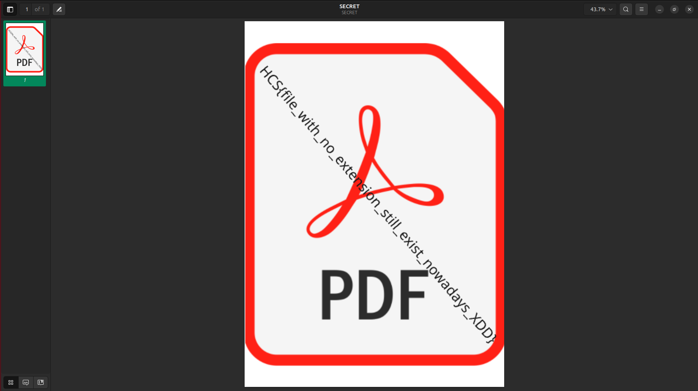

# blind file
 >Ohh noooo! what is thisss??? can you help me?!?!
 
 ## The challenge
 
 Given a zip file named `file`

 ## How to solve?

 First, I tried to extract the file. Upon extracted, there is a folder named `file`. Inside the folder there is a `SECRET` file with no file extension.


 By opening `SECRET` with Document Viewer, I can see the file ... and the flag also ...

 

 ## The flag
 ```
 HCS{file_with_no_extension_still_exist_nowadays_XDD}
 ```