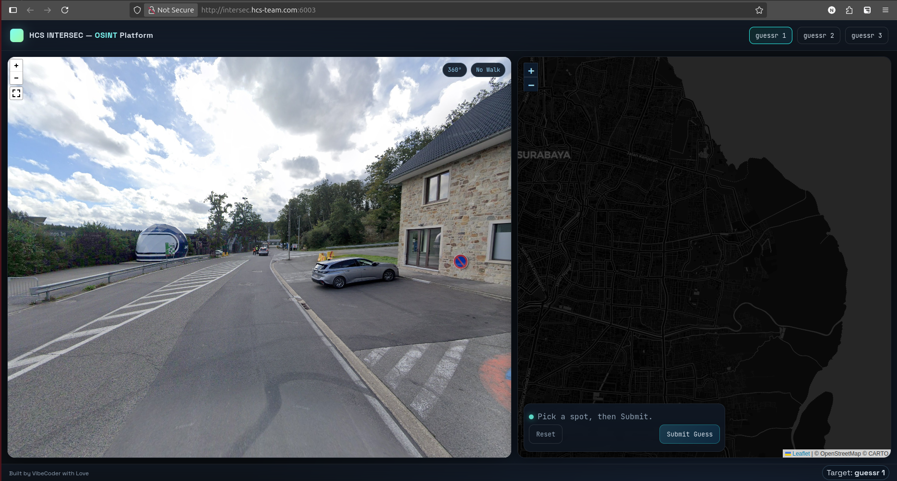

# guessr1
> "must be the ~wind~ water."
>
> http://intersec.hcs-team.com:6003/

## The challenge
It's a no-walk geoguessr-type of challenge. It spawns me next to a police station and across a big parking lot. A big-blue-helmet can be seen with `1961-1970` and `JACK` written. A restricted area can be seen ahead by the guards and a gate.



By the surroundings, I can already guess it is somewhere in Eurpoe by the road markers and the pine forest scenery.


Looking a bit left from the helmet, there is a obscured `...hamps.be` text, and a grandstand.

.png)

## How to solve

~I already know where this is, but i'll keep going~

The `.be` domain extension is associated with Belgium. 

Let's search at google with keyowrd such as `big blue helmet belgium 1961 1970 jack`. 

.png)

It will mostly show military helmet, except a wikipedia page. It's about Brabham. Let's give it a quick read.

.png)

So we know that Jack Brabham did Formula One racing from 1961-1970. It's the same as the year written in the big helmet. So now we can conclude that it is associated about racing in Belgium. So where is Formula One racing in belgium?

It's on circuit Spa de Francorchamps!

Now it makes sense why we see '...hamps.be' and a grandstand.

So now we head for that circuit. Remember the grandstands? There are only two grandstands that looked alike by the looks from the chall. And remember the huge parking place also . Ive annotated on the map.

.png)

The exact place must be around that road with a parking lot. It's time to pinpoint the exact location!

.png)

## The flag
```
HCS{s0_wh3n_w45_7h3_l457_71m3_f3rr4r1_w0n_7h3_wcc?}
```

