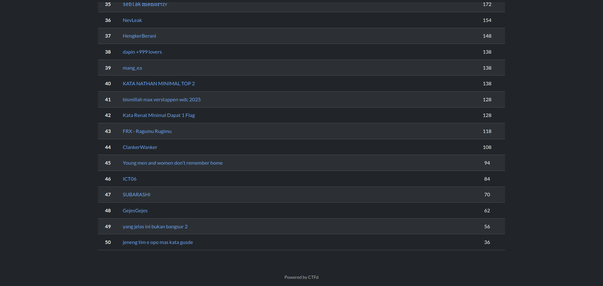
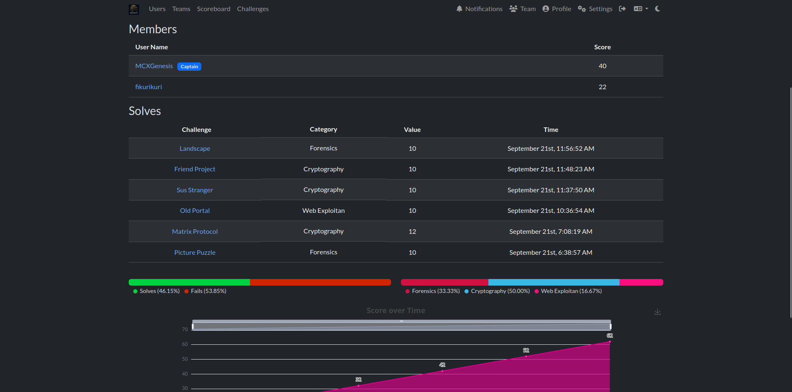

# Srifoton CTF 2025 Write-up

The Srifoton CTF Competition 2025 is held by Himpunan Mahasiswa Informatika of Sriwijaya University on 21st September 2025 and lasted for 6 hours.

I teamed up with [Fikuri](https://github.com/FikuriKuri) in team `GejesGejes` (iykyk). Our team placed `48` out of `50` (which is almost dead last). We gained `62` points and solver `6` challenges.

This is the write-up submitted to the competition committee written in Indonesian and in PDF Format. The given file/folder challenge will be provided in folders (there are some unsolved challenges too).

It's a bitter-sweet-rough for me, but it's better than regretting.

GG\
GG\
GG\
GG\
GG